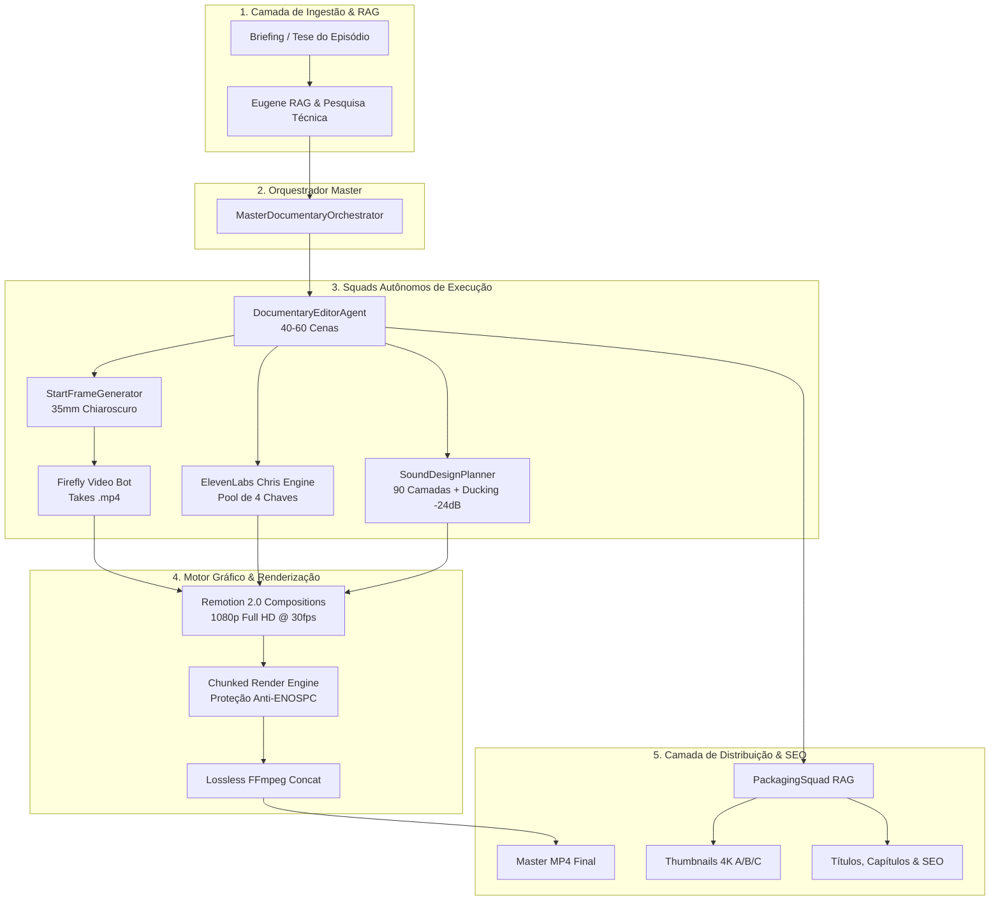

# 📘 PROJETO "O OUTRO LADO" (HIDDEN SYSTEMS LAB)
## DOCUMENTO INTEGRADO: PRD, ARQUITETURA DE SISTEMAS & BRIEFING EXECUTIVO
*Versão:* 2.0.0-PROD | *Classificação:* Engenharia de Automação Audiovisual Autônoma

---

# 📑 SUMÁRIO EXECUTIVO

1. **PARTE I — PRD (PRODUCT REQUIREMENTS DOCUMENT)**
   * 1.1 Visão do Produto & Tese Central
   * 1.2 O Problema do Mercado Audiovisual
   * 1.3 A Solução de Automação Autônoma
   * 1.4 Personas & Público-Alvo
   * 1.5 Requisitos Funcionais (FR-01 a FR-08)
   * 1.6 Requisitos Não-Funcionais (NFR-01 a NFR-06)
   * 1.7 Métricas de Sucesso (KPIs de Canal & Produção)
2. **PARTE II — ARQUITETURA TÉCNICA DO SISTEMA**
   * 2.1 Diagrama de Camadas & Fluxo de Dados
   * 2.2 Os 8 Squads de Agentes Autônomos
   * 2.3 Motor Gráfico Programático (Remotion 2.0 + Motion 3D)
   * 2.4 Motor de Locução & Failover de Quota (ElevenLabs Pool)
   * 2.5 Sound Design RAG (90 Camadas & Ducking -24dB)
   * 2.6 Estratégia de Tolerância a Falhas & Render Segmentado
   * 2.7 Regras de Isolamento de Bancos (Supabase Central vs HFT)
3. **PARTE III — BRIEFING EXECUTIVO & MANUAL DE MARCA**
   * 3.1 DNA Editorial & Estilo Narrativo (Vox / Johnny Harris)
   * 3.2 Identidade Visual (Denis Villeneuve 35mm Chiaroscuro)
   * 3.3 Paleta de Cores e Tipografia Oficial
   * 3.4 Matriz de Embalagem & Neurociência Visual (YouTube A/B/C)
   * 3.5 Estrutura Padrão dos 6 Capítulos de Cada Episódio

---

# 🚀 PARTE I — PRD (PRODUCT REQUIREMENTS DOCUMENT)

## 1.1 Visão do Produto & Tese Central
O **"O Outro Lado"** é uma plataforma autônoma de geração de documentários investigativos de média duração (5 a 10 minutos) focada em **Deep Tech e Infraestruturas Ocultas**. 

> **A Tese:**  
> A sociedade moderna foi condicionada a acreditar que o mundo digital é imaterial e flutua na nuvem. A realidade é o inverso: **toda tecnologia é física, colossal, consome gigawatts de energia e opera sob pressões extremas**. O canal existe para dissecar e revelar a máquina invisível por trás do cotidiano.

## 1.2 O Problema do Mercado Audiovisual
* **Custo & Tempo Proibitivos:** A produção tradicional de um documentário no padrão *Vox* ou *Bloomberg Originals* exige equipes de 5 a 8 pessoas (roteirista, diretor, locutor, motion designer 3D, sound designer, designer de thumbnails) e leva de **15 a 30 dias** por vídeo, com custo de R$ 5.000 a R$ 15.000 por episódio.
* **Gargalos de Escala:** Canais convencionais não conseguem manter consistência semanal sem perda de qualidade visual e profundidade técnica.

## 1.3 A Solução de Automação Autônoma
Um pipeline de **8 Squads de IA e Motores Programáticos** que transforma uma simples ideia/tema em um **pacote completo de publicação para o YouTube Studio em menos de 15 minutos de processamento**, sem intervenção humana, garantindo qualidade cinematográfica 35mm e rigor estatístico/técnico.

## 1.4 Personas & Público-Alvo
* **O Curioso Técnico (22 a 45 anos):** Profissionais de tecnologia, engenharia, finanças e estudantes que buscam entender o funcionamento real dos sistemas ("Como o Pix liquida em 1,2s?", "Por onde passam os cabos de internet do Brasil?").
* **O Consumidor de Documentários:** Fãs do formato investigativo estilo *Johnny Harris*, *Kurzgesagt*, *ColdFusion* e *Wendover Productions*.

## 1.5 Requisitos Funcionais (FR)

| ID | Nome do Requisito | Descrição |
|---|---|---|
| **FR-01** | *Concepção do Roteiro em 6 Capítulos* | O sistema deve estruturar automaticamente um arco narrativo de 5 a 10 minutos dividido em 6 capítulos progressivos. |
| **FR-02** | *Direção de Cenas Inéditas* | O `DocumentaryEditorAgent` deve conceber entre 40 e 60 cenas detalhadas do zero por episódio, especificando enquadramentos, luz e movimento. |
| **FR-03** | *Geração de Start Frames 35mm* | O sistema deve sintetizar imagens 16:9 em estética cinematográfica Chiaroscuro sem reaproveitar assets de episódios passados (*Zero Reuso*). |
| **FR-04** | *Geração de Takes de Vídeo* | O robô do Firefly deve gerar takes `.mp4` dinâmicos para todas as cenas com movimentos de câmera (push-in, pan, drift). |
| **FR-05** | *Locução com Rotação de Chaves* | Síntese de voz com o narrador `Chris` (ElevenLabs), rotacionando dinamicamente um pool de 4 chaves API em caso de quota esgotada. |
| **FR-06** | *Sound Design Orquestrado por Contexto* | Planejamento e mixagem de 90+ camadas sonoras (Sub-bass, Foley elétrico, Impactos) com ducking dinâmico a -24dB sob a voz. |
| **FR-07** | *Composição & Motion Graphics 3D* | Renderização em Full HD 1080p @ 30fps no Remotion 2.0 integrando esquemáticos 3D, mapas batimétricos e telemetria. |
| **FR-08** | *Embalagem A/B/C & SEO* | Geração de 3 thumbnails 4K em neurociência de atenção visual, títulos complementares, descrição em camadas e tags de entidades. |

## 1.6 Requisitos Não-Funcionais (NFR)

* **NFR-01 (Duração Obrigatória):** Todo episódio master deve ter entre 300 e 600 segundos (9.000 a 18.000 frames @ 30fps).
* **NFR-02 (Estabilidade de Render & ENOSPC):** O pipeline de renderização deve operar de forma segmentada (chunks) para nunca ultrapassar 2 GB de uso temporário de disco simultâneo.
* **NFR-03 (Tolerância a Falhas de API):** Em caso de falha de conexão ou 429 em serviços de IA externos, o sistema deve utilizar fallback inteligente para assets documentais de alta resolução sem interromper a esteira.
* **NFR-04 (Isolamento de Bancos de Dados):** O banco de dados da plataforma central (`xwclmxjeombwabfdvyij`) e o banco do catalogador HFT (`ypqekkkrfklaqlzhkbwg`) são estritamente isolados e nunca devem trocar dados ou conexões.
* **NFR-05 (Qualidade de Áudio & Vídeo):** Vídeo codificado em H.264 High Profile 1080p, áudio master em AAC 48kHz Stereo com faixa dinâmica controlada.

## 1.7 Métricas de Sucesso (KPIs)
* **Taxa de Cliques (CTR):** > 8.5% no YouTube Studio (graças à matriz A/B/C de neurociência).
* **Retenção Média (AVD):** > 52% nos primeiros 5 minutos (alimentada por trocas de cena a cada 4-7s e sound design dinâmico).
* **Tempo de Produção Total:** < 15 minutos para geração completa do pacote master.

---

# 🏛️ PARTE II — ARQUITETURA TÉCNICA DO SISTEMA

## 2.1 Diagrama de Camadas & Fluxo de Dados



---

## 2.2 Os 8 Squads de Agentes Autônomos

```
┌────────────────────────────────────────────────────────────────────────────────────────┐
│ SQUAD 1: ROTEIRO & TESE         ── Formulação da premissa investigativa e 6 capítulos   │
│ SQUAD 2: DIREÇÃO DE CENAS       ── Engenharia de 40-60 cenas, planos e especificações   │
│ SQUAD 3: SÍNTESE 35MM           ── Geração de novos Start Frames (Zero Reuso)           │
│ SQUAD 4: VÍDEO GENERATIVO       ── Geração de takes de vídeo .mp4 via IA                │
│ SQUAD 5: LOCUÇÃO CHRIS          ── Voz oficial ElevenLabs com pool de 4 chaves API     │
│ SQUAD 6: SOUND DESIGN RAG       ── 90 camadas sonoras com ducking dinâmico a -24dB      │
│ SQUAD 7: REMOTION 2.0 & 3D      ── Renderização gráfica e esquemáticos telemetrizados   │
│ SQUAD 8: EMBALAGEM & SEO        ── Capas 4K A/B/C, metadados e retenção algorítmica     │
└────────────────────────────────────────────────────────────────────────────────────────┘
```

---

## 2.3 Motor Gráfico Programático (Remotion 2.0 + Motion 3D)
O sistema não utiliza editores tradicionais (Premiere, After Effects). Toda a composição é código React/TypeScript executado pelo Remotion:

* 🔬 [**`SubmarineCableCrossSection3D.tsx`**](file:///c:/Users/brend/OneDrive/Desktop/PROJETO%2030K%20ATE%2027/02%20-%20O%20OUTRO%20LADO/AUTOMACAO%20-%20O%20OUTRO%20LADO/remotion/documentary/SubmarineCableCrossSection3D.tsx): Raio-X volumétrico das 7 camadas mecânicas.
* 🗺️ [**`AtlanticBathymetryMap.tsx`**](file:///c:/Users/brend/OneDrive/Desktop/PROJETO%2030K%20ATE%2027/02%20-%20O%20OUTRO%20LADO/AUTOMACAO%20-%20O%20OUTRO%20LADO/remotion/documentary/AtlanticBathymetryMap.tsx): Topografia submarina do Atlântico e rotas globais.
* ⚡ [**`ErbiumOpticalAmplifier.tsx`**](file:///c:/Users/brend/OneDrive/Desktop/PROJETO%2030K%20ATE%2027/02%20-%20O%20OUTRO%20LADO/AUTOMACAO%20-%20O%20OUTRO%20LADO/remotion/documentary/ErbiumOpticalAmplifier.tsx): Repetidor EDFA com física de excitação quântica.
* 📡 [**`BgpFailoverInspector.tsx`**](file:///c:/Users/brend/OneDrive/Desktop/PROJETO%2030K%20ATE%2027/02%20-%20O%20OUTRO%20LADO/AUTOMACAO%20-%20O%20OUTRO%20LADO/remotion/documentary/BgpFailoverInspector.tsx): Simulação de corte e failover em 14.2 milissegundos.
* 🎞️ [**`AnamorphicCinematicOverlay.tsx`**](file:///c:/Users/brend/OneDrive/Desktop/PROJETO%2030K%20ATE%2027/02%20-%20O%20OUTRO%20LADO/AUTOMACAO%20-%20O%20OUTRO%20LADO/remotion/documentary/AnamorphicCinematicOverlay.tsx): Granulação orgânica 35mm e vinheta anamórfica Denis Villeneuve.

---

## 2.4 Motor de Locução & Failover de Quota (ElevenLabs)
* **Voz:** `Chris` (`iP95p4xoKVk53GoZ742B`) | **Modelo:** `eleven_multilingual_v2`.
* **Pool Dinâmico:** 4 chaves API com alternância automática e logging de consumo por cena.
* **Saída:** Áudio master [`narration.mp3`](file:///c:/Users/brend/OneDrive/Desktop/PROJETO%2030K%20ATE%2027/02%20-%20O%20OUTRO%20LADO/AUTOMACAO%20-%20O%20OUTRO%20LADO/runs/OOL-EP02-CABOS/postproduction/narration.mp3) e arquivo [`scene_timings.json`](file:///c:/Users/brend/OneDrive/Desktop/PROJETO%2030K%20ATE%2027/02%20-%20O%20OUTRO%20LADO/AUTOMACAO%20-%20O%20OUTRO%20LADO/runs/OOL-EP02-CABOS/postproduction/scene_timings.json) com precisão de milissegundos para sincronização de cortes.

---

## 2.5 Sound Design RAG (90 Camadas & Ducking)
* **Estrutura:** Mapeamento sonoro individual para cada uma das 50 cenas baseado no contexto emocional e técnico.
* **Ducking Dinâmico:** A trilha sonora principal é atenuada para **-24dB** na presença de locução, subindo automaticamente nas transições visuais e revelações de esquemáticos 3D.

---

## 2.6 Estratégia Anti-ENOSPC & Renderização Segmentada
Para vídeos longos (5 a 10 min / 9.000 a 18.000 frames), a renderização direta pode consumir mais de 15 GB em arquivos temporários e causar estouro de disco (`ENOSPC`).
O sistema adota a arquitetura de **Renderização em Chunks**:
1. O episódio é dividido em **4 blocos de ~3.400 frames** cada.
2. Cada bloco é renderizado individualmente em formato `.mp4`.
3. O cache temporário é limpo ao término de cada bloco.
4. O `ffmpeg` une os blocos via `concat` sem recompressão (0 perdas, execução em 1 segundo).

---

## 2.7 Regras de Isolamento de Bancos (Zero Cruzamento)

```
┌──────────────────────────────────────┐     ┌──────────────────────────────────────┐
│       BANCO CENTRAL PLATAFORMA       │     │          BANCO HFT QUANT             │
│  Projeto: xwclmxjeombwabfdvyij       │  X  │  Projeto: ypqekkkrfklaqlzhkbwg       │
│  Cliente: src/lib/supabaseClient.ts  │     │  Cliente: src/lib/hftSupabase.ts     │
│  Tabelas: profiles, iq_bots, etc.    │     │  Tabelas: hft_oracle_results, etc.   │
└──────────────────────────────────────┘     └──────────────────────────────────────┘
                   ▲                                            ▲
                   │ (ZERO CRUZAMENTO DE CHAVES E CÓDIGO)       │
```

---

# 🎨 PARTE III — BRIEFING EXECUTIVO & MANUAL DE MARCA

## 3.1 DNA Editorial & Estilo Narrativo
* **Tom:** Investigativo, curioso, preciso, sem sensacionalismo vazio.
* **Regra de Ouro do Roteiro:** *"Nunca diga apenas que algo é grande ou rápido. Diga exatamente quantos metros, quantos volts, quantos milissegundos e compare com uma escala física tangível."*
* **Fórmula do Gancho Inicial (Primeiros 15s):**
  1. Quebra de crença comum (*"Você acha que o sinal vem do satélite..."*).
  2. O contraste brutal (*"Na realidade, 99% viaja por 25 milímetros no fundo do mar..."*).
  3. O que está em jogo (*"O que acontece se uma âncora cortar esse cabo agora?"*).

---

## 3.2 Identidade Visual (Denis Villeneuve 35mm)
* **Luz Chiaroscuro:** Iluminação lateral de alto contraste, separando o objeto do fundo preto.
* **Composição:** Enquadramentos de lente anamórfica, foco seletivo em materiais reais (aço, vidro, cobre, água salgada).
* **Ausência de Texto Sujo:** Todo texto é renderizado pelo Remotion com tipografia editorial limpa e técnica (código de telemetria, coordenadas, tensão elétrica).

---

## 3.3 Paleta de Cores Oficial
* ⬛ **Preto Carbono (`#060709`):** Fundo soberano, elegância e profundidade abissal.
* 🟧 **Laranja Laser (`#FF5500`):** Alerta, tensão, perigo, pontos de ruptura física.
* 🟦 **Ciano Telemetria (`#00F0FF`):** Fibras de sílica, pulsos de laser, redes de dados.
* ⬜ **Branco Puro (`#FFFFFF`):** Tipografia técnica e rótulos de esquemáticos.

---

## 3.4 Matriz de Embalagem & Neurociência Visual (YouTube A/B/C)

| Variante | Tese Psicológica | Título no YouTube | Headline na Capa (1-3 Palavras) | Ponto Focal da Imagem |
|---|---|---|---|---|
| **Variante A** | *Busca & Intenção Direta* | Como a Internet Chega ao Brasil: Os Cabos Submarinos no Fundo do Oceano | `25 MILÍMETROS` | Raio-X do cabo em macro comparado com a mão humana |
| **Variante B** | *Impacto & Consequência* | O Cabo de 25mm no Fundo do Mar que Sustenta a Internet de 200 Milhões de Pessoas | `SE O CABO CORTAR?` | Âncora colidindo contra o cabo no abismo com faísca |
| **Variante C (Principal)** | *Paradoxo & Investigação Oficial* | O Outro Lado da Internet: O Que Acontece Se os Cabos Submarinos Forem Cortados? | `NO FUNDO DO MAR` | Rosto humano em choque + cabo brilhando no fundo escuro |

---

## 3.5 Estrutura dos 6 Capítulos Padrão

```
┌────────────────────────────────────────────────────────────────────────┐
│ CH01: O GATILHO & O MITO COTIDIANO (00:00 - 00:50)                      │
│ ➔ O toque no celular e a ilusão dos satélites no espaço.              │
├────────────────────────────────────────────────────────────────────────┤
│ CH02: A ANATOMIA DO SISTEMA // RAIO-X 3D (00:50 - 01:45)               │
│ ➔ As 7 camadas de blindagem mecânica e os 12 pares de sílica pura.    │
├────────────────────────────────────────────────────────────────────────┤
│ CH03: O ABISMO E AS LEIS DA FÍSICA (01:45 - 02:40)                     │
│ ➔ 400 atm de pressão, repetidores EDFA e circuito de terra no mar.    │
├────────────────────────────────────────────────────────────────────────┤
│ CH04: OS BÚNKERS DE CONEXÃO (02:40 - 03:35)                            │
│ ➔ Estações CLS em Fortaleza e Praia Grande conectando ao IX.br.       │
├────────────────────────────────────────────────────────────────────────┤
│ CH05: A AMEAÇA E A RESILIÊNCIA (03:35 - 04:45)                         │
│ ➔ Ruptura por âncoras, alarme LOS, laser OTDR e failover BGP em 15ms. │
├────────────────────────────────────────────────────────────────────────┤
│ CH06: CONCLUSÃO // A FRAGILIDADE OCULTA (04:45 - 07:33)                │
│ ➔ A densidade física da tecnologia e a dependência da civilização.    │
└────────────────────────────────────────────────────────────────────────┘
```

---

## 📁 4. ESTRUTURA DE DIRETÓRIOS DO PROJETO

```
AUTOMACAO - O OUTRO LADO/
├── PRD_ARQUITETURA_BRIEFING.md        # Este documento oficial de especificações
├── remotion/                          # Composições e componentes gráficos do Remotion
│   ├── Episode01Pix.tsx               # Composição do Episódio 01 (O Pix)
│   ├── Episode02Cabos.tsx             # Composição do Episódio 02 (Os Cabos Submarinos)
│   ├── episode02TimelineData.ts       # Metadados de timing das 50 cenas
│   └── documentary/                   # Biblioteca de componentes 3D e motion
│       ├── SubmarineCableCrossSection3D.tsx
│       ├── AtlanticBathymetryMap.tsx
│       ├── ErbiumOpticalAmplifier.tsx
│       ├── BgpFailoverInspector.tsx
│       ├── DynamicDocumentaryMedia.tsx
│       └── AnamorphicCinematicOverlay.tsx
├── orchestrator/                      # Orquestrador Master de 8 Etapas
│   └── masterDocumentaryOrchestrator.ts
├── hsl/                               # Motores de síntese e controle de qualidade
│   └── startframe/startFrameGenerator.ts
├── config/                            # Regras invioláveis de produção
│   └── productionSafetyGuard.ts
├── scripts/                           # Scripts de automação, render e tooling
│   ├── buildAllPhotorealScenes.py     # Gerador de cenas reais 35mm
│   ├── renderEpisode02Chunked.py      # Renderizador em chunks anti-ENOSPC
│   └── syncPublicMedia.py             # Sincronizador de assets públicos
├── public/editorial/execution/        # Assets estáticos consumidos pelo Remotion
│   ├── SC_001 a SC_050/               # 50 Cenas com start_frame.png e take.mp4
│   └── postproduction_ep02/           # Master de narração e sound design
└── runs/OOL-EP02-CABOS/               # Pacote final gerado para publicação
    ├── final_master.mp4               # Vídeo Master 1080p Full HD
    └── postproduction/                # Thumbnails 4K, Descrição, Metadados e SEO
```
