# Arquitetura - Hidden Systems Lab

Atualizado em: 2026-08-20

## Fluxo

```mermaid
flowchart LR
    AR[Abraham Reference Snapshot] --> RI[Reference Insight Ingest]
    ER[Eugene Chroma Snapshot] --> EGR[Eugene Stage Retrieval]
    U[Editor humano] --> B[Episode Brief]
    RI --> B
    EGR --> AS[Audience Strategy]
    AS --> B
    B --> R[Research + Source Pack]
    R --> C[Claim Registry]
    C --> T[Thesis + Causal Model]
    T --> AT[Attention Architecture]
    AS --> AT
    AT --> S[English Script]
    S --> PG[Reference Phrase Gate]
    S --> EPG[Eugene Phrase Gate]
    S --> V[Visual Plan]
    AS --> V
    V --> CD[Beat + Shot + Continuity Directors]
    V --> G[Originality and Safety Gate]
    AT --> PD[Promise Delivery Gate]
    AS --> PD
    PD --> G
    G --> RM[Remotion Assets]
    G --> REAL[Licensed or Public Material]
    CD --> X[Execution Compiler]
    X --> RM[Remotion Choreography]
    X --> K[Approved Start Frames + Kling Motion]
    K --> KV[ffprobe + SHA-256 + AI Label]
    RM --> A[Remotion Assembly]
    REAL --> A
    KV --> A
    A --> N[ElevenLabs Narration]
    N --> DL[Dialog Leveling -16 LUFS]
    DL --> LQ[Narration Loudness QA]
    X --> SD[Sound FX Cue Plan]
    SD --> SM[Kenney CC0 Assets + 48 kHz SFX Bed]
    LQ --> MX[Remotion Audio Assembly]
    SM --> MX
    MX --> Q[Provenance + Monetization + Final QA]
    Q --> F[16:9 Final Documentary]
    R --> DB[(Mission Control SQLite)]
    K --> FDB[(Firefly Jobs SQLite)]
    Q --> E[JSONL + Manifests + Source Notes]
```



## Estados ativos

1. `IDLE`
2. `BRIEFING_RECEIVED`
3. `HSL_EDITORIAL_PREPRODUCTION_RUNNING`
4. `HSL_EPISODE_PACKAGE_READY`
5. `FIREFLY_INGESTION_PENDING`
6. `FIREFLY_GENERATION_RUNNING`
7. `FIREFLY_GENERATION_COMPLETED`
8. `HSL_REMOTION_POSTPRODUCTION_RUNNING`
9. `FINAL_VIDEO_RENDERED`
10. `PRODUCTION_FAILED`

## Componentes locais

- `ProductionRunner`: orquestra estados e adapters.
- `HiddenSystemsLabAdapter`: valida as fontes HSL e executa pre e pos-producao.
- `hslEpisodeGate`: valida pauta, fontes, cenas, disclosure e originalidade.
- `MotionToFireflyBridge`: preserva start frame, hash e metadata HSL.
- `KlingProviderPromptAdapter`: aplica cinematografia industrial 16:9 e restricoes de seguranca.
- `FireflyAdapter`: executa e monitora jobs externos.
- `FireflyToIntakeBridge`: valida todos os MP4s e exige lineage real do motion package e do start frame antes da montagem.
- `AgentTelemetryAdapter`: registra eventos em SQLite, JSONL e WebSocket.
- `HslEditorialRuntime`: executa briefing, pesquisa, claims, tese, modelo causal, roteiro, plano visual e gate.
- `ReferenceInsightIngestAgent`: le o snapshot local filtrado; os arquivos Abraham nunca entram no source pack factual.
- `EugeneRagIngestAgent`: valida o indice derivado do Chroma com lineage do PDF e do banco.
- `EugeneRagRetrievalAgent`: recupera desejo, consciencia, sofisticacao, mecanismo, crenca e headline conforme a etapa.
- `AudienceStrategyAgent`: transforma retrieval e seed aprovado em estrategia de publico, promessa, titulo, thumbnail e progressao.
- `EugeneRagOriginalityGate` e `PromiseDeliveryGate`: bloqueiam copia e promessa nao entregue.
- `AttentionArchitectureAgent`: registra hook, loop, payoff, reframe e pausas sem reescrever a narracao aprovada.
- `PhraseOriginalityGate`: bloqueia correspondencias literais de dez palavras usando apenas fingerprints SHA-256.
- `CinematicDirectionShadowRunner`: gera beats, shot direction e continuidade em sidecars atomicos.
- `CinematicExecutionCompiler`: converte pacote editorial e sidecars aprovados em contratos de execucao.
- `HslStartFrameRuntime`: valida imagem fisica, 16:9, resolucao, aprovacao e SHA-256.
- `HslFireflyGenerationRuntime`: prepara o batch Kling e exige autorizacao explicita para dispatch pago.
- `HslSoundFxRuntime`: converte eventos de cena em cues, valida e adapta assets Kenney CC0, mistura a faixa SFX e executa QA.
- `HslPostproductionRuntime`: resolve videos, footage licenciado, narracao nivelada, QA de loudness, SFX e render Remotion.

## Fronteiras de verdade

- editor humano aprova tese e publicacao;
- source pack sustenta claims;
- schema sustenta estrutura;
- start frame e SHA sustentam identidade visual de uma cena Kling;
- o intake rejeita jobs sem hash real; nao existe fallback sintetico de lineage;
- job Firefly sustenta estado da geracao;
- arquivo, `ffprobe` e SHA sustentam existencia do video;
- manifesto de procedencia sustenta origem e licenca;
- plano, asset hash, faixa estereo 48 kHz e QA sustentam cada efeito sonoro;
- hashes dos arquivos, estatisticas ASR e fingerprints irreversiveis sustentam a referencia editorial sem armazenar sua prosa;
- hash do PDF, hash do Chroma, recibos por pagina e 61.033 fingerprints sustentam a camada Eugene sem torna-la fonte factual;
- WAV PCM, medicao em duas passagens e `NARRATION_AUDIO_QA_PASS` sustentam a voz usada no master;
- dashboard apenas apresenta dados.
- sidecars cinematograficos nao sao enviados diretamente ao Kling; somente o compiler aprovado produz contratos executaveis.

## Camada cinematografica e compiler

```text
approved scene -> NarrativeBeatDirectorAgent -> CinematicShotDirectorAgent
               -> ContinuityDirectorAgent -> cinematic sidecars
               -> CinematicExecutionCompiler -> executable scene contract
```

O scene sidecar usa `hsl.cinematic.scene.v1` revisao `1.3.0`; o manifesto de episodio usa `hsl.cinematic.episode.v1` revisao `1.1.0`. O compiler adiciona ritmo, microeventos, transicoes, coreografia Remotion, prompt de Start Frame e movimento Kling, preservando as decisoes editoriais aprovadas.

## Contrato de cena

```json
{
  "scene_id": "HSL_018",
  "claim_id": "C007",
  "narrative_function": "explain_mechanism",
  "visual_mode": "remotion_flow_trace",
  "evidence_status": "fact",
  "asset_provenance": "original_remotion",
  "source_url": "https://source.example",
  "license_status": "not_applicable",
  "original_contribution": "custom causal diagram",
  "ai_disclosure_required": false,
  "review_status": "approved"
}
```

Reconstrucao generativa usa `generated_ai`, `illustrative|not_evidence`, `ai_disclosure_required: true` e `AI VISUALIZATION`.

## Topologia atual

- TypeScript/Node no Mission Control;
- SQLite local em WAL;
- Firefly Automation externo em Python;
- fonte HSL em OneDrive, configurada por `HSL_PROJECT_ROOT`;
- Remotion 4 local com composicao `HslEpisode` em 1920x1080 e 30 fps;
- dashboard Express/WebSocket na porta 3333.

## Motion Design V2

Explicacoes precisas permanecem deterministicas no Remotion. Firefly/Kling fica reservado para movimento fisico, escala, atmosfera e reconstrucoes que nao dependem de texto ou geometria informacional exata.

O contrato `hsl.motion-design.v2` e compilado por visual shot e contem `template`, `headline`, `stages`, `takeaway`, `beats`, direcao e cor semantica. Contratos de execucao antigos recebem o mesmo design como fallback durante a pos-producao, sem invalidar Start Frames, aprovacoes ou lineage Firefly existentes.

A biblioteca possui dez modulos:

- `FLOW_MAP`;
- `BRANCHING_ROUTES`;
- `PROCESS_CUTAWAY`;
- `STATE_TRANSITION`;
- `CAPACITY_VS_AVAILABILITY`;
- `BOTTLENECK`;
- `PARALLEL_TURNAROUND`;
- `DELAY_PROPAGATION`;
- `BEFORE_AFTER`;
- `EVIDENCE_CARD`.

Cada modulo revela headline, mecanismo, mudanca e consequencia em beats temporais. Textos internos de direcao editorial, como `resolve into the stated consequence`, sao removidos antes do renderer. Cenas tipograficas usam revelacao cinetica por palavra e destaque semantico.

## Comportamento fail-closed

Cada runtime valida os artefatos que recebeu e bloqueia quando falta fonte, aprovacao, Start Frame, licenca, MP4, narracao ou autorizacao de custo. Nenhum runtime fabrica source pack, lineage, asset, licenca ou render de sucesso.

## Premium Motion multi-provedor

Depois do `VisualShotDirectorAgent`, o `MotionRouteDirectorAgent` escolhe `KLING_CINEMATIC`, `VEO_MOTION_GRAPHIC`, `VEO_REMOTION_HYBRID` ou `REMOTION_DETERMINISTIC`. O Start Frame Runtime cria pacotes Kling antigos ou pacotes Veo com base, preview, overlay, caminho, audio, regras negativas e aprovacao.

O Firefly recebe um guia multi-provedor com configuracao por item. O intake registra modelo, origem, hash, audio solicitado, audio observado e fidelidade do primeiro frame. Na pos-producao, Veo fornece movimento espacial e audio opcional; Remotion recompõe texto exato e mistura narracao, stem nativo e Kenney.

Detalhes e contratos: `docs/HSL-PREMIUM-MOTION-VEO.md`.
