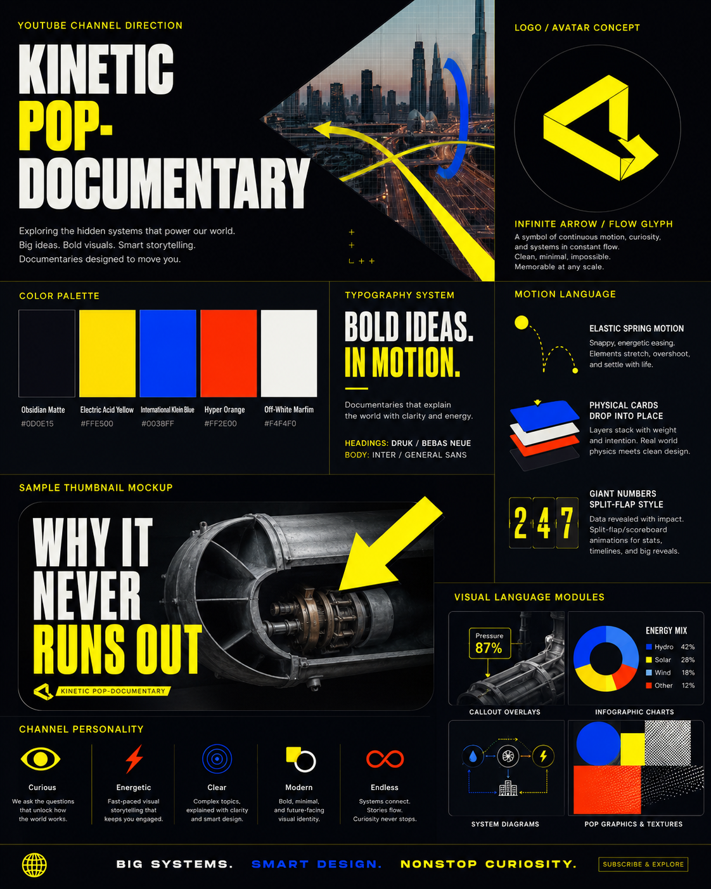
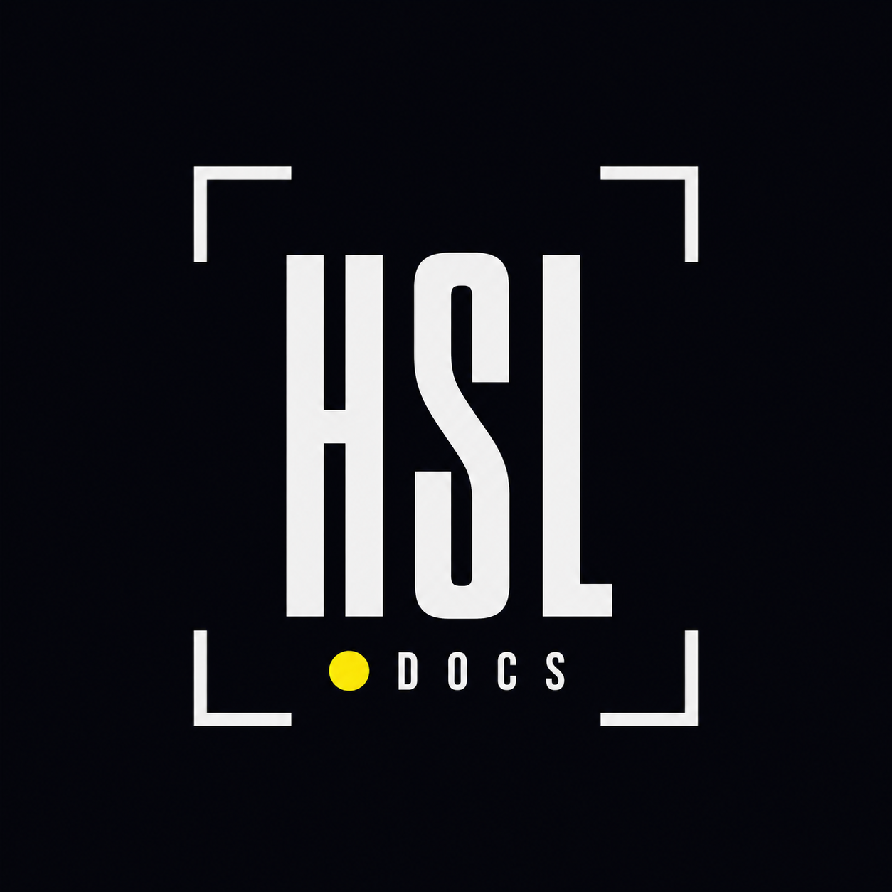

# Hidden Systems Lab - Brand System

Atualizado em: 2026-08-19

## Marca

Nome: **Hidden Systems Lab**
Assinatura curta: **HSL Docs**
Estetica: **Kinetic Pop-Documentary**

O logo oficial recebido usa `HSL DOCS` em branco, ponto amarelo e cantoneiras de enquadramento sobre fundo Obsidian Matte. A arte conceitual tambem apresenta o Infinite Arrow / Flow Glyph amarelo como simbolo de fluxo continuo.





## Formato

- 16:9;
- master 3840x2160;
- render 1920x1080;
- 30 fps;
- safe margin de 64 px em 1080p;
- nenhuma pessoa olhando para a camera.

## Cores

| Token | Cor | Funcao |
|---|---|---|
| `COLOR_BG_DARK` | `#0D0E15` | fundo principal |
| `COLOR_SURFACE` | `#161824` | cards e paineis |
| `COLOR_SURFACE_BORDER` | `#26293D` | bordas e grid |
| `COLOR_ACCENT_YELLOW` | `#FFE500` | foco, seta e hero metric |
| `COLOR_ACCENT_BLUE` | `#0038FF` | infraestrutura e fluxo secundario |
| `COLOR_STATE_BOTTLENECK` | `#FF2E00` | gargalo, calor e bloqueio |
| `COLOR_STATE_RECOVERY` | `#00FF85` | redundancia e recuperacao |
| `COLOR_TEXT_PRIMARY` | `#F4F4F0` | texto principal |
| `COLOR_TEXT_MUTED` | `#8C90A4` | fontes e telemetria |

Nao usar cores fora da tabela sem nova decisao de marca.

## Tipografia

- headings: Bebas Neue;
- body: Inter;
- telemetria: JetBrains Mono.

Escala 1080p:

- hero: 96-120 px;
- card header: 44-56 px;
- apoio: 22-26 px;
- labels e fontes: 14-16 px.

## Layout global

Toda composicao Remotion deve incluir:

- watermark `HSL DOCS` no topo esquerdo;
- capitulo no topo direito;
- fonte/claim no rodape esquerdo;
- rotulo de reconstrucao no rodape direito quando aplicavel;
- area central livre para diagrama, footage ou Kling.

## Movimento

```ts
export const MOTION_CONFIGS = {
  elasticPop: { damping: 12, mass: 0.6, stiffness: 180 },
  smoothPan: { damping: 20, mass: 1.0, stiffness: 80 },
  heavyDrop: { damping: 14, mass: 1.2, stiffness: 140 }
};
```

- entrada: escala 0.8 para 1 e fade em 8 frames;
- saida: fade de 4 frames sem overshoot;
- transicao: hard cut ou whip-pan de 6 frames com rastro amarelo;
- mudanca visual ou movimento a cada 4-7 segundos.

## Modulos essenciais

- `HeroMetricCard`;
- `KineticFlowTrace`;
- `ViewfinderCallout`;
- `SystemSplitFlap`;
- `EvidenceSourceBadge`;
- `SystemMap`;
- `LayerStack`;
- `CutawayDiagram`;
- `FaultTree`;
- `DependencyGraph`;
- `AIReconstructionLabel`.

## Kling modifier

```text
[SPECIFIC ACTION OR STRUCTURE], documentary cinematography, 35mm lens,
shot on Arri Alexa, industrial palette with matte charcoal and controlled
vibrant yellow highlights, volumetric haze, slow continuous mechanical
movement, hyper-realistic textures, no human faces looking at camera,
high contrast, clean architectural framing.
```

Texto, logo, labels e dados sao adicionados no Remotion. Nao pedir ao Kling que gere tipografia legivel.

## Thumbnail

Formula: objeto central isolado, detalhe mecanico forte, seta amarela grande e no maximo uma frase curta em Bebas Neue. A thumbnail deve prometer o mecanismo real entregue pelo episodio, sem falso misterio.

## Audio

- trilha eletroacustica minimalista e industrial;
- narracao ativa: trilha em -18 dB;
- bumper sem voz: ate -6 dB;
- SFX de pop, gargalo e chapter drop sincronizados com a acao;
- atmosfera continua sob o episodio.
