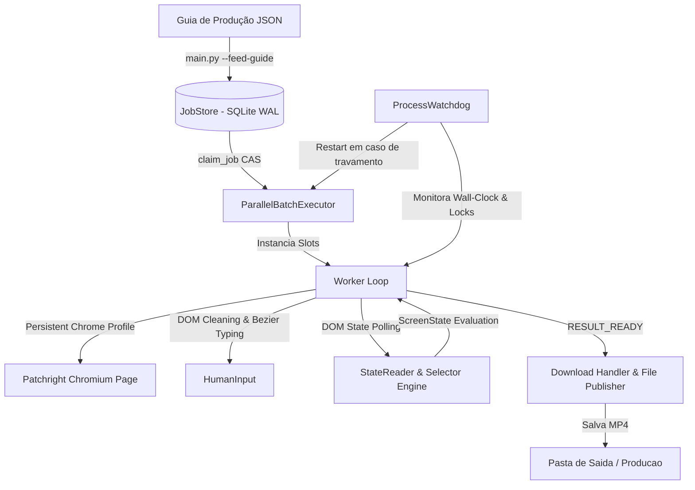
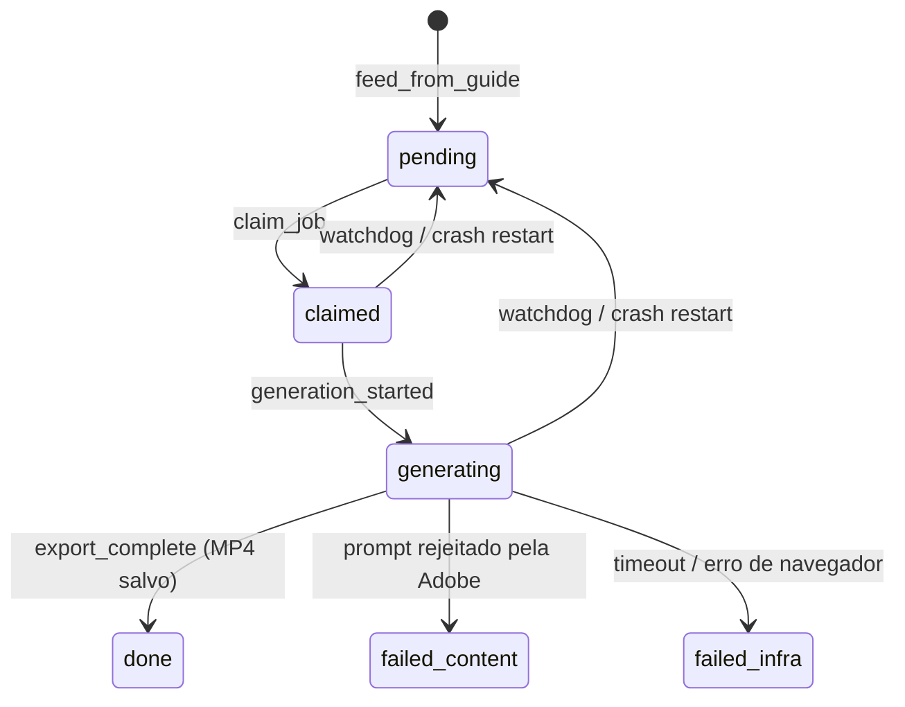

# 🏗️ Arquitetura do Sistema — Firefly Video Automation Bot

> **Versão**: 2.0.0  
> **Status**: Produção  
> **Tecnologias**: Python Asyncio, Patchright (Chromium), SQLite WAL, Tiptap DOM Injector, PlaywrightCursor (Bézier)  

---

## 🖼️ 1. Visão Geral da Arquitetura

O sistema é construído sobre uma arquitetura modular em camadas assíncronas centrada em uma máquina de estados com persistência transacional SQLite (CAS - *Compare-And-Swap*). O orquestrador gerencia a automação do navegador Chromium persistente sem interferir na sessão de usuário salva.



---

## 🧩 2. Componentes e Módulos do Sistema

### 2.1. Ingestão e CLI Orquestrador ([main.py](file:///c:/Users/brend/OneDrive/Desktop/B2%20ENTERPRISE/Canais_/Mateo%20-%20Copia/agente%20firefly/firefly_bot/main.py))
- Interface de linha de comando (CLI) responsável por:
  - `--feed-guide <json>`: Alimenta a tabela `jobs` no banco de dados.
  - `--run [--concurrency N]`: Inicia o loop de execução assíncrono.
  - `--status`: Exibe o relatório de jobs no terminal.

### 2.2. Hub de Persistência CAS ([job_store.py](file:///c:/Users/brend/OneDrive/Desktop/B2%20ENTERPRISE/Canais_/Mateo%20-%20Copia/agente%20firefly/firefly_bot/job_store.py))
- Implementa a classe `JobStore` operando em SQLite modo **WAL** (*Write-Ahead Logging*).
- **Transações Atômicas CAS**: Nenhuma transição de estado ocorre sem validar o estado anterior (`status_before -> status_after`).
- **Recuperação Automática**: Converte jobs abandonados ou estagnados de `claimed`/`generating` de volta para `pending` em caso de encerramento inesperado.



### 2.3. Motor de Automação de Navegador ([worker.py](file:///c:/Users/brend/OneDrive/Desktop/B2%20ENTERPRISE/Canais_/Mateo%20-%20Copia/agente%20firefly/firefly_bot/worker.py))
- `Worker`: Gerencia uma aba do Chromium dedicada a um slot de execução.
- **Sequência de Preparação da Tela**:
  1. `_open_video_generation()`: Força a navegação limpa para `FIREFLY_VIDEO_URL` descartando modais ou telas de erro antigas.
  2. `_configure_model()`: Seleciona **Kling 3.0** ou **Veo 3.1 Fast** conforme o job.
  3. `_configure_resolution()`: Seleciona **720p**.
  4. `_configure_aspect_ratio()`: Seleciona **9:16**.
  5. `_configure_duration()`: Ajusta a duração para **5 segundos**.
  6. `_configure_audio()`: Confirma audio ligado ou desligado conforme `generate_audio`.

### Jobs Veo 3.1 Fast

- configuracao de modelo, duracao e audio pertence ao item do batch;
- duracoes validas: 4, 6 ou 8 segundos;
- Start Frame continua obrigatorio;
- audio pode ser solicitado, mas sua presenca e qualidade sao validadas no intake do Mission Control;
- jobs Kling antigos conservam audio desligado e comportamento anterior.
  7. `_upload_first_frame()`: Envia a imagem PNG do computador local.
  8. **DOM Wipe**: Injeta código JavaScript que limpa o editor ProseMirror/Tiptap (`innerHTML = '<p></p>'`) e preenche o prompt com `.fill(text)`.
  9. Clica no botão **Gerar** e passa o job para `generating`.

### 2.4. Leitor de Estado DOM ([state_reader.py](file:///c:/Users/brend/OneDrive/Desktop/B2%20ENTERPRISE/Canais_/Mateo%20-%20Copia/agente%20firefly/firefly_bot/state_reader.py) & [selectors.py](file:///c:/Users/brend/OneDrive/Desktop/B2%20ENTERPRISE/Canais_/Mateo%20-%20Copia/agente%20firefly/firefly_bot/selectors.py))
- Avalia o estado atual da aba inspecionando seletores em ordem estrita de prioridade:

| Prioridade | Estado (`ScreenState`) | Método DOM | Seletor | Descrição |
|---|---|---|---|---|
| 1 | `LOGGED_OUT` | `url_pattern` | `TODO:SELETOR` | URL de Login / Expirado |
| 2 | `CONTENT_REJECTED` | `text` | `"Não foi possível processar esse prompt"` | Moderação de Prompt Rejeitado |
| 3 | `QUOTA_EXHAUSTED` | `text` | `TODO:SELETOR` | Limite de Créditos |
| 4 | `ERROR_TOAST` | `role` | `TODO:SELETOR` | Toast de Erro |
| 5 | `RESULT_READY` | `css` | `[data-testid="generate-video-download-button"]:not([aria-disabled="true"])` | Botão Baixar Ativo |
| 6 | `STILL_GENERATING` | `css/text` | Progress / Spinning | Renderização em Andamento |

### 2.5. Autenticação e Perfil de Usuário ([chrome_profile.py](file:///c:/Users/brend/OneDrive/Desktop/B2%20ENTERPRISE/Canais_/Mateo%20-%20Copia/agente firefly/firefly_bot/chrome_profile.py))
- Carrega o contexto persistente do Patchright Chromium a partir do diretório:
  `c:\Users\brend\OneDrive\Desktop\B2 ENTERPRISE\Canais_\Mateo - Copia\agente firefly\data\chrome_profile`
- Preserva cookies, LocalStorage e tokens OAuth da Adobe ativos entre sessões.

### 2.6. Guardião de Processos ([watchdog.py](file:///c:/Users/brend/OneDrive/Desktop/B2%20ENTERPRISE/Canais_/Mateo%20-%20Copia/agente%20firefly/firefly_bot/watchdog.py))
- Monitora a saúde do worker loop.
- Se o tempo total estritamente contado (*wall-clock*) ultrapassar `WATCHDOG_WALL_CLOCK` (800.000 ms = 13,3 minutos), o Watchdog força o cancelamento e reinicia o loop assíncrono.

---

## 📊 3. Esquema Físico do Banco de Dados SQLite (`data/firefly_jobs.db`)

### Tabela `jobs`
```sql
CREATE TABLE IF NOT EXISTS jobs (
    id INTEGER PRIMARY KEY AUTOINCREMENT,
    name TEXT UNIQUE NOT NULL,
    prompt TEXT NOT NULL,
    image_path TEXT NOT NULL,
    model TEXT NOT NULL DEFAULT 'Kling 3.0',
    resolution TEXT NOT NULL DEFAULT '720p',
    aspect_ratio TEXT NOT NULL DEFAULT '9:16',
    duration_seconds INTEGER NOT NULL DEFAULT 5,
    status TEXT NOT NULL DEFAULT 'pending',
    attempts INTEGER NOT NULL DEFAULT 0,
    output_path TEXT,
    created_at TIMESTAMP DEFAULT CURRENT_TIMESTAMP,
    updated_at TIMESTAMP DEFAULT CURRENT_TIMESTAMP
);
```

---

## 🔒 4. Matriz de Segurança e Anti-Loop

1. **Anti-Loop Policy**: Se um erro ocorrer 2 vezes no mesmo componente, o sistema aborta a retentativa automática e exige intervenção/diagnóstico.
2. **Tempo Limite de Geração**: `GENERATION_BUDGET = 600.000 ms` (10 minutos).
3. **Limpeza JS DOM Obrigatória**: NUNCA depender apenas de `.fill()`; o editor Tiptap exige injeção nativa de eventos DOM e `.innerHTML = '<p></p>'`.
4. **Zero Mudar Dependências Fora da Venv**: Executa estritamente utilizando a virtualenv do projeto (`.\.venv\Scripts\python.exe`).
