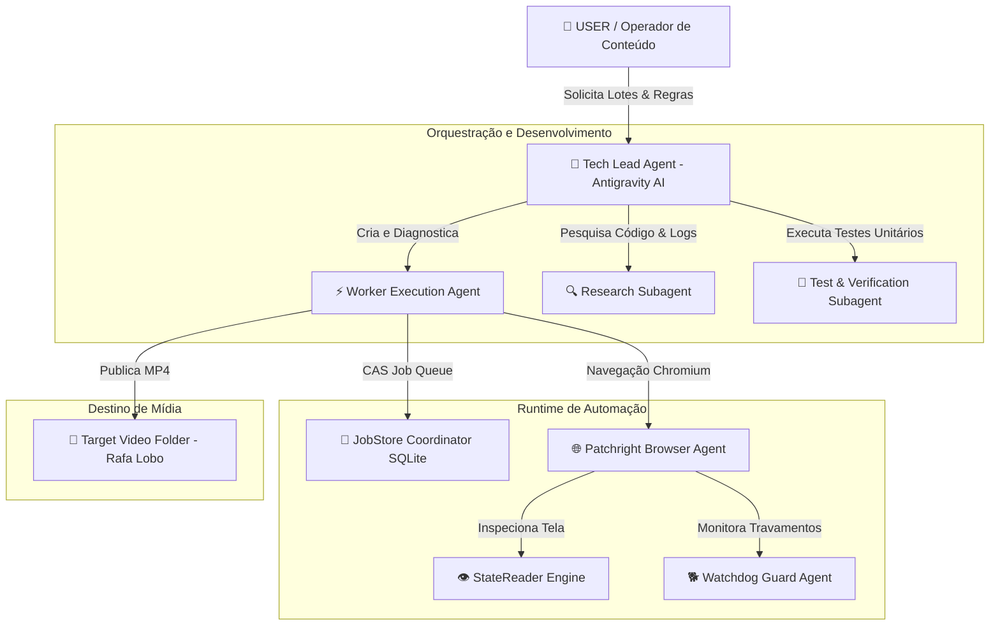

# 🤖 Mapa de Agentes e Subagentes — Ecossistema Firefly Automation

> **Versão**: 2.0.0  
> **Status**: Ativo  
> **Escopo**: Mapeamento de Papéis, Permissões, Ferramentas e Hierarquia de Agentes no Projeto  

---

## 🗺️ 1. Hierarquia Geral do Ecossistema

O ecossistema de automação opera através de uma hierarquia clara de agentes humanos, IA supervisora (Antigravity), subagentes de pesquisa/execução e bots de runtime automatizados.

---

## 🎭 2. Definição Detalhada dos Agentes

### 🧠 2.1. Tech Lead Senior Agent (Antigravity AI)
- **Papel**: Líder Técnico do Projeto e Engenheiro Quantitativo/Automação.
- **Responsabilidades**:
  - Garantir a integridade da arquitetura assíncrona (`asyncio`, `patchright`, `sqlite3`).
  - Manter as regras do projeto invioláveis (sem código bloqueante, timeouts seguros, idempotência).
  - Analisar logs detalhados e screenshots de erro (`screenshots/job_*_worker_failure.png`) antes de diagnosticar falhas.
  - Ajustar seletores DOM (`selectors.py`), rotinas de digitação (`human_input.py`) e limpeza de tela.
- **Ferramentas Atribuidas**: `replace_file_content`, `run_command`, `view_file`, `list_dir`, `write_to_file`, `grep_search`, `manage_task`.

---

### ⚡ 2.2. Worker Execution Agent ([worker.py](file:///c:/Users/brend/OneDrive/Desktop/B2%20ENTERPRISE/Canais_/Mateo%20-%20Copia/agente%20firefly/firefly_bot/worker.py))
- **Papel**: Executor assíncrono do lote de trabalhos de geração de vídeo.
- **Responsabilidades**:
  - Reclamar jobs pendentes via transações atômicas `claim_job()`.
  - Orquestrar a sequência de ações na página web (Navegação limpa ➔ Escolha de Modelo Kling 3.0 ➔ Resolução 720p ➔ Aspect Ratio 9:16 ➔ Duração 5s ➔ Desativar Áudio ➔ Upload de Quadro ➔ Injeção de Prompt ➔ Clique em Gerar).
  - Aguardar a conclusão da renderização e acionar o download automático.
- **Permissões**: Acesso direto à instância Playwright Chromium e ao banco de dados SQLite local.

---

### 👁️ 2.3. StateReader Watchdog Agent ([state_reader.py](file:///c:/Users/brend/OneDrive/Desktop/B2%20ENTERPRISE/Canais_/Mateo%20-%20Copia/agente%20firefly/firefly_bot/state_reader.py))
- **Papel**: Sistema de Visão Computacional / Inspeção DOM.
- **Responsabilidades**:
  - Ler o estado da interface a cada intervalo configurado (`poll_interval_seconds = 3.0s`).
  - Identificar com precisão milimétrica se a tela se encontra em:
    - `LOGGED_OUT`
    - `CONTENT_REJECTED` (Identifica `"Não foi possível processar esse prompt"`)
    - `QUOTA_EXHAUSTED`
    - `RESULT_READY` (Botão Baixar habilitado)
    - `STILL_GENERATING`
- **Regras Invioláveis**: Nunca confundir o atributo `alt="Não é possível carregar"` de imagens de *placeholder* com mensagens reais de rejeição de prompt.

---

### 🐕 2.4. Process Watchdog Guard Agent ([watchdog.py](file:///c:/Users/brend/OneDrive/Desktop/B2%20ENTERPRISE/Canais_/Mateo%20-%20Copia/agente%20firefly/firefly_bot/watchdog.py))
- **Papel**: Guardião de Saúde e Recuperação de Processos em Segundo Plano.
- **Responsabilidades**:
  - Monitorar o tempo estritamente transcorrido (*wall-clock*).
  - Detectar abas ou processos Chromium travados por tempo superior a `WATCHDOG_WALL_CLOCK` (800.000 ms).
  - Forçar o encerramento limpo do contexto travado e reiniciar a fila automaticamente.

---

### 🔍 2.5. Research & Verification Subagent
- **Papel**: Subagente isolado para análise de código e verificação de testes unitários.
- **Responsabilidades**:
  - Rodar o conjunto de testes `pytest -q` para garantir 100% de cobertura e passagem de contratos.
  - Inspecionar a estrutura do banco SQLite via scripts dedicados em `scratch/`.

---

## 🔄 3. Matriz de Permissões e Fluxo de Comunicação entre Agentes

| Agente Origem | Agente Destino | Canal / Mecanismo | Objetivo |
|---|---|---|---|
| USER | Tech Lead | Prompt Chat Interface | Enviar diretivas de lote, pastas de saída e regras auto-accept. |
| Tech Lead | Worker Execution Agent | Terminal Background Task (`run_command`) | Iniciar `main.py --run --concurrency 1`. |
| Worker Agent | StateReader Engine | `read_screen_state()` Async Call | Consultar estado atual do DOM na aba ativa. |
| Worker Agent | JobStore Coordinator | SQLite Async CAS Queries | Atualizar status (`pending` ➔ `claimed` ➔ `generating` ➔ `done`). |
| Watchdog Guard | Worker Execution Agent | Cancellation Token / Exception | Reiniciar lote estagnado se estourar tempo limite. |
