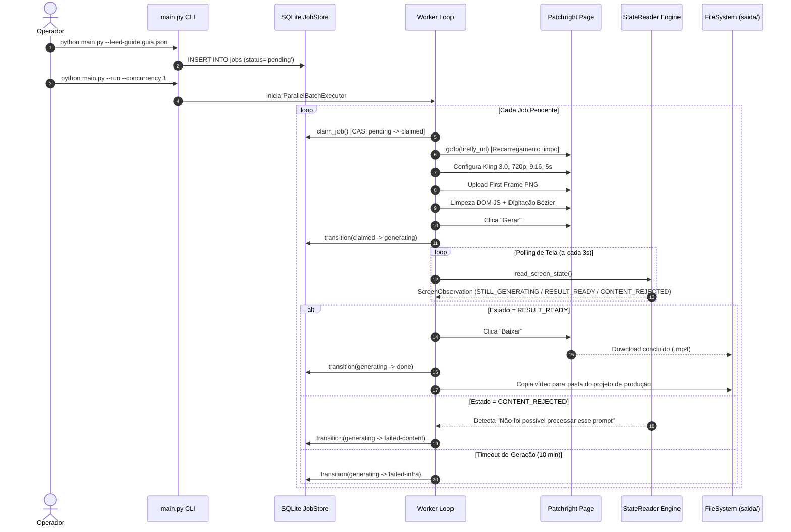
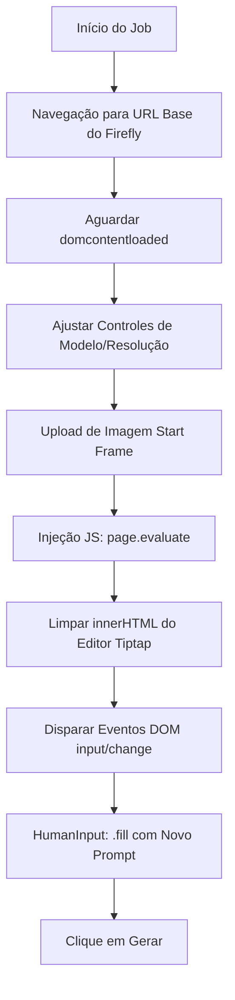

# 🔄 Processos Operacionais e Fluxogramas — Firefly Video Automation

> **Versão**: 2.0.0  
> **Status**: Produção  
> **Escopo**: Manuais de Operação, Fluxos de Execução e Diagramas de Sequência  

---

## 📌 1. Fluxo de Execução de Ponta a Ponta

O diagrama a seguir descreve a sequência exata de processamento de um take (Job) desde a ingestão via JSON até a gravação final do arquivo `.mp4`.



---

## 🛠️ 2. Guia de Operação e Comandos CLI

### 2.1. Ingestão de Guia de Produção
Para registrar novos vídeos na fila de geração:
```powershell
.\.venv\Scripts\python.exe main.py --feed-guide "C:\caminho\para\guia_producao.json"
```

### 2.2. Execução da Automação (Modo Solo ou Concorrente)
Para rodar a fila sequencialmente (Recomendado para estabilidade de abas):
```powershell
.\.venv\Scripts\python.exe main.py --run --concurrency 1
```

Para rodar com múltiplas abas simultâneas no mesmo contexto do Chrome:
```powershell
.\.venv\Scripts\python.exe main.py --run --concurrency 3
```

### 2.3. Verificação de Status da Fila
Para inspecionar o status detalhado no SQLite:
```powershell
.\.venv\Scripts\python.exe main.py --status
```

### 2.4. Reset de Jobs Pendentes (Script Auxiliar)
Caso deseje resetar jobs travados para re-tentativa limpa:
```powershell
.\.venv\Scripts\python.exe C:\Users\brend\.gemini\antigravity\brain\<conv-id>\scratch\update_prompts_and_reset.py
```

---

## 🧼 3. Procedimento de Limpeza e Sanitização do DOM

Para evitar contaminação por cache visual, o robô executa o seguinte protocolo de sanitização a cada job:



---

## 🛡️ 4. Política Anti-Loop e Recuperação Automatizada

1. **Watchdog de Parede (*Wall-Clock Watchdog*)**:
   Se a execução estagnar por mais de `WATCHDOG_WALL_CLOCK` (800.000 ms = 13.3 minutos), o Watchdog encerra o processo do navegador Chromium e força uma reinicialização limpa.
2. **Prevenção contra Moderação Falso-Positiva**:
   A checagem de erros busca estritamente pela string completa de erro da Adobe (`"Não foi possível processar esse prompt"`), impedindo que imagens de *placeholder* interrompam prematuramente a renderização.
